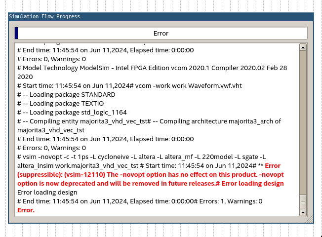

# LSP Linux Guide

**(For english version please follow [this link](en/README.md))**

## Úvod

Tento návod vznikl jako soubor návodů k vyřešení problémů vzniklých rozdíly v OS (Windows / Linux - primárně Ubuntu 20.04 LTS),
na které jsem narazil při řešení domácích úloh v předmětu LSP na FEL ČVUT.

> Pozn. použití Ubuntu 22.04 LTS může být problematické vzhledem k přejmenování některých závislostí (např. lib32gcc1 na lib32gcc1-s1)

## Instalace Quartus II
Instalace je prakticky totožná jako na [Windows](https://dcenet.fel.cvut.cz/edu/fpga/install.aspx) - doporučuji však verzi [20.1](https://www.intel.com/content/www/us/en/software-kit/661017/intel-quartus-prime-lite-edition-design-software-version-20-1-for-linux.html)
Spouštění pak probíhá přes 

```
cd intelFPGA_lite/20.1/quartus/bin 
./quartus
```

(Pozn. cestu bude třeba upravit pokud při instalaci zvolíte jiný adresář než domovský adresář Vašeho uživatelského účtu)

## Připojení desky - zpřístupnění USBBlasteru

postupujte dle: https://www.rocketboards.org/foswiki/Documentation/UsingUSBBlasterUnderLinux

> Pozn. Na ubuntu 22.04 jsem se setkal s problémem s JTAGem kdy jsem nezprovoznil nahrávání do desky. Tento problém jsem bohužel již nedořešil. 

## Simulace (.vwf)

Obecně řečeno - řešení všech problémů spojených ze simulací lze vyčíst z Error logu, pro zjednodušení zde uvádím celý postup.

Čekají Vás celkem tři opravy - jednu je nutné provést pouze jednou, zbylé dvě pravděpodobně vždy -

### 1. Oprava názvu .vwf souboru


Pokud se pokoušíte spustit simulaci po přejmenování Waveform souboru z defaultního _Waveform.vwf_, je třeba opravit jeho název v okně _Simulation-\>Simulation Settings_ v řádku _Testbench Generation Command_ flag _--vector_source_.


### 2. Oprava flagu -novopt



Ve vzorové simulaci je defaultně obsažen ve scriptu simulace flag _-novopt_ který způsobuje chybu, jelikož již je _depricated_. Stačí jej odstranit.


### 3. Instalace potřebných knihoven / závislostí

Chybu jsem se nepokoušel replikovat - poznáte z error logu, pokud nastane. Pro vyřešení nainstalujte potřebné závislosti podle [tohoto návodu](https://gist.github.com/ihsan314/2343959869d2ed4f3c5835a5473bff58#how-to-install-modelsim-and-quartus-on-fedora-32-and-ubuntu-2004).

## Update souboru v programmeru

Narazil jsem na bug, kdy v programmeru zůstává označený k nahrání jiný soubor, než je aktuální zkompilovaná Top-Level Entity. Stačí je jen nastavit nastavit v programmeru správný output (.sof) file přes ikonu _Add file_.

## Simulace LCD s GHDL

GHDL je další linux nativní nástroj a proto je jeho použití na linuxu ve výsledku jedndodušší, jelikož tak nevyžaduje 
instalaci a běh v subsystému. 

I přesto instalace GHDL přináší menší obtíž - prosím vyvarujte se stránky http://ghdl.free.fr a využívejte pouze https://ghdl.github.io/ghdl/

Pokud používáte ubuntu, instalace je jednoduchá - použijte buď snap, a nebo si stahněte některý z [posledních releasů](https://github.com/ghdl/ghdl/releases) (doporučuje se mcode varianta).
Nevyužívejte apt! Obsahuje zastaralou verzi, která neobsahuje mnohé nutné.

```
sudo snap install ghdl
```
### Simulace pro HW3

#### Konverze .bat na .sh

Od roku 2024 je v LSP k simulaci LCD displaye k dispozici .bat script. Ten zde poskytuji přepsaný do bashe.
Návod na úpravu testbench souboru je tedy shodný pro Windows i Linux a mělo by tak stačit pouze opravit cestu 
výstupu v souboru testbench\_LCDlogic.vhd (viz ToDo 1 - constant FILE\_NAME) a případně opravit názvy komponent (viz ToDo 2).

Následná simulace by pak měla být už jen spuštěním skriptu [runtb.sh](ghdl_sim/runtb.sh) přemístěného do složky simulation ve Quartus projektu:

```
./runtb.sh
```

#### LSPTools - wine

První (a zdá se že i jediný) problém nastává u nutného použití **LSPTools**. Ty jakožto .exe soubor nejsou standardně kompatibilní s Linuxem.
Přesto je lze s větším či menším úspěchem spustit za pomocí nástroje wine. Ten jelikož bylo použito .NET frameworku je třeba pro funkčnost rozšířit o
wine-mono. Ten lze přidat následovně:

1. Stahněte [wine-mono.msi](https://dl.winehq.org/wine/wine-mono/)
2. Spusťte přes příkazovou řádku `wine64 uninstaller`
3. Zvolte ikonu install a vložte stažený .msi soubor
4. Zavřete dialogové okno uninstalleru

U nástrojů **Bitmap to VHDL** a **LCD Geometry Rulers** se zdá by pak již neměl být problém. 

Ovšem **Testbench Viewer** jsem nezprovoznil. Jednodušší bylo připravit [tento python script](ghdl_sim/lsp_txt_to_ppm.py), který převádí výstup simulace na .ppm

### Simulace pro HW4

Stejně jako pro HW3 jsem přepsal .bat skript pro spuštění simulací v ghdl do [bashe](ghdl_sim/runtbanim.sh) a upravil jsem předešlý [python script](ghdl_sim/lsp_txt_to_gif.py) 
tak, aby prošel celý vygenerovaný soubor a udělal ze každého obsaženého "frame" jeden "frame" .gif . K dostání i jako uživatelsky přívětivější [Jupyter notebook](ghdl_sim/lsp_txt_to_anim.ipynb).


## Disclaimer

Prosím berte všechny poskytnuté kódy spíše jako takové ["art of bodge"](https://www.youtube.com/watch?v=lIFE7h3m40U)... 
nejsou krásné, nejsou dokonalé, nejsou dokonce ani úplné, ale účel většinou plní. 

Složitější věci se pokusím ozdrojovat - z pravidla jsem je nevymyslel, spíš někde poctivě ukradl.

Díky mnohokrát a přeji příjemný průchod studiem!

