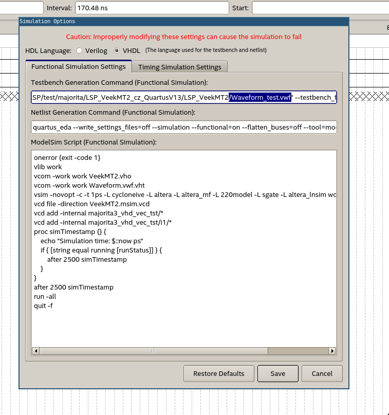
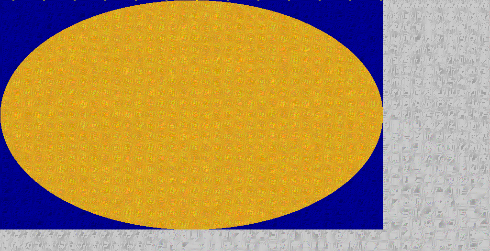

# LSP Linux Guide

## About

This tutorial began as a repository of all the needed tutorials I used to troubleshoot while working on the HWs for LSP at FEE CTU. Text below is primarily aimed towards Ubuntu 20.04 LTS users.

> Note: The use of other versions of Ubuntu such as 22.04 LTS may be problematic due to the renaming of some quartus dependencies (such as lib32gcc1 to lib32gcc1-s1)

## Instalation of Quartus II
Instalation is similar to the [Windows instalation](https://dcenet.fel.cvut.cz/edu/fpga/install_en.aspx) - I suggest using version [20.1](https://www.intel.com/content/www/us/en/software-kit/661017/intel-quartus-prime-lite-edition-design-software-version-20-1-for-linux.html)
Starting the application can be achieved by commands:

```
cd intelFPGA_lite/20.1/quartus/bin 
./quartus
```

(Note:  path to _intelFPGA\_/..._ will need to be adjusted to the place of your selected installation)

## Board connection - enabling USBBlaster

follow this tutorial: https://www.rocketboards.org/foswiki/Documentation/UsingUSBBlasterUnderLinux

> Note: On Ubuntu 22.04 there seems to be a problem with JTAG which I could not resolve thus could not get the programmer to work.

## Simulation (.vwf)

Generally - solution to all of the following problems can be found in the Error log.

Three repairs need to be done

### 1st .vwf file name


If you renamed your Waveform file from the default _Waveform.vwf_ it is required to change the name accordingly in the _Simulation-\>Simulation Settings_ window. Change the _--vector_source_ flag in the _Testbench Generation Command_ textbox.




### 2nd -novopt flag


In the default setting of our simulaiton, there is a depricated _-novopt_ flag present in the _ModelSim Script_ textbox. Delete it to resolve this error.


### 3. library/dependency installation

I did not try to replicate this error - you will recognize it yourself from the error logs. It can be resolved by installing the dependencies stated in [this tutorial](https://gist.github.com/ihsan314/2343959869d2ed4f3c5835a5473bff58#how-to-install-modelsim-and-quartus-on-fedora-32-and-ubuntu-2004).

## Programmer - old .sof file

I encountered a bug, where when switching projects, a .sof file would not reload in the programmer accordingly to the loaded project. Set it manually by the _Add file_ icon and adjust.

## LCD simulation with GHDL

GHDL is a linux native program and thus its usage on linux is easier as it does not require to run any subsystem.

There is a slight issue nevertheless - please be aware of the page http://ghdl.free.fr. **Avoid it** and use only the official https://ghdl.github.io/ghdl/

On Ubuntu the installation is easy - please use snap, or download one of the [latest releases](https://github.com/ghdl/ghdl/releases) (the _mcode_ variant is highly suggested).

```
sudo snap install ghdl
```

*DO NOT USE apt !* There is an old version of ghdl on apt that lacks the majority of functionalities that we need.

### HW3 Simulation
#### .bat to .sh
Since the year 2024 there is a .bat script available for this simulation - I provide it rewriten in bash. Thus steps that need to be done to the .bat file in Windows are idetnical to the ones that need to be done to the .sh script on Linux (e.g. update the path to the testbench file).

Then update the output file name to linux format in _testbench\_LCDlogic.vhd_ (ad ToDo 1 - constant FILE\_NAME) and eventually update component names (ad ToDo 2).

Simulate by running the script [runtb.sh](../ghdl_sim/runtb.sh) in the _simulation_ folder of your Quartus project. 


```
./runtb.sh
```

#### Running LSPTools with wine
The first (and it seems that only) problem arises with the inevitable need to use **LSPTools**, which as a .exe file are not compatible with Linux.
It can be run using wine with the wine-mono as .NET framework was used.

Install wine and add wine-mono with these steps:

1. Download [wine-mono.msi](https://dl.winehq.org/wine/wine-mono/)
2. Run `wine64 uninstaller` in the terminal
3. Click the install icon and select the downloaded .msi file
4. Close the uninstaller dialog window

Now you should be able to run **LSPTools** on Linux.


The **Bitmap to VHDL** and **LCD Geometry Rulers** tools seem to be working, but unfortunately I could not make the **Testbench Viewer** work. At this point it was easier to build a [python based substitution](../ghdl_sim/lsp_txt_to_ppm.py), that converts the simulation output to a .ppm image file.

### HW4 Simulation

As well as in the case of HW3 I provide an updated rewriten provided .bat script in [bash](../ghdl_sim/runtbanim.sh) and the image generating [python script](../ghdl_sim/lsp_txt_to_gif.py) 
that generates a .gif of all the provided frames in the output file
Available also as a more convenient [Jupyter notebook](../ghdl_sim/lsp_txt_to_anim.ipynb).



## Disclaimer
Please - be aware that all provided codebase is more of an["art of bodge"](https://www.youtube.com/watch?v=lIFE7h3m40U) than anything else...
They are not beautiful, nor perfect, not even remotely complete, but they usually fulfill their purpose.

I will try to put links to the more advanced stuff - I did not come up with the majority of these solutions, they were found online.

Thank you for your feedback and I hope this document might help you to pass with ease.

